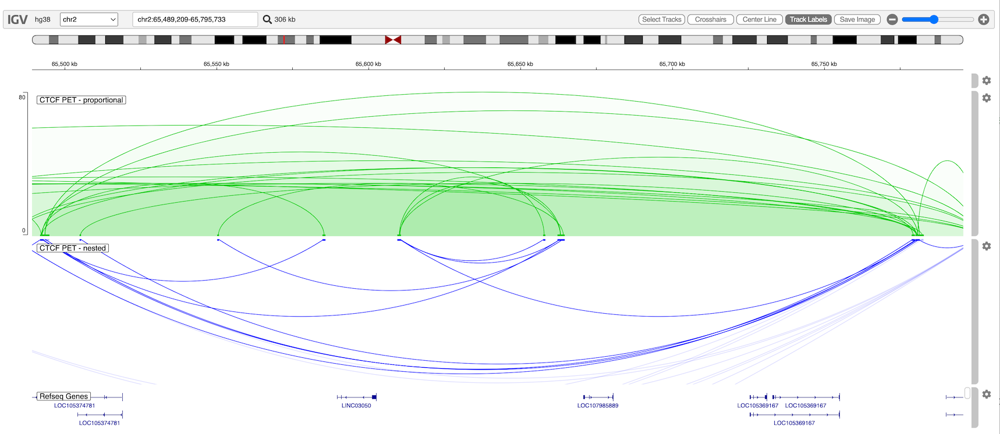

<p class="page-title">Interact Track</p>

The interact track (`type = 'interact'`) visualizes pairwise interactions between genome regions as arcs.

## File formats

* [bedpe](https://bedtools.readthedocs.io/en/latest/content/general-usage.html)
* [interact](https://genome.ucsc.edu/goldenPath/help/interact.html) 
* [bigInteract](https://genome.ucsc.edu/goldenPath/help/interact.html)

## Configuration Options

[General options](Tracks.md#options-for-all-track-types)

| Property       | Description                                                                             | Default  |
|----------------|-----------------------------------------------------------------------------------------|----------|
| arcType        | See below                                                                               | "nested" |
| arcOrientation | Direction of arcs ("UP" or "DOWN")                                                      | "UP"     |
| alpha          | Alpha transparency to apply to arcs that extend beyond viewport. Number between 0 and 1 | 0.5      |
| thickness      | Line thickness                                                                          | 2        |

### Arc types

* nested - Arc height is proportional to feature width. 
* propotional - Arc height is proportional to feature score.
* inView - Proportional type, only arcs that are completely in view are drawn.
* partialInView - Proportional type, only arcs that are whole or partially in view are drawn.

## Example

```javascript
    const options =
    {
        genome: "hg38",
        locus: "chr2:65,489,209-65,795,733",
        tracks: [
            {
                url: "https://s3.amazonaws.com/igv.org.demo/GSM1872886_GM12878_CTCF_PET.bedpe.txt",
                type: "interact",
                format: "bedpe",
                name: "CTCF PET - proportional",
                arcType: "proportional",
                arcOrientation: "UP",
                color: "rgb(0,200,0)",
                logScale: true,
                max: 80,
                visibilityWindow: 10000000
            },
            {
                url: "https://s3.amazonaws.com/igv.org.demo/GSM1872886_GM12878_CTCF_PET.bedpe.txt",
                type: "interact",
                format: "bedpe",
                name: "CTCF PET - nested",
                arcType: "nested",
                arcOrientation: "DOWN",
                color: "blue",
                alpha: 0.15,
                visibilityWindow: 10000000
            }
        ]
    }
```

